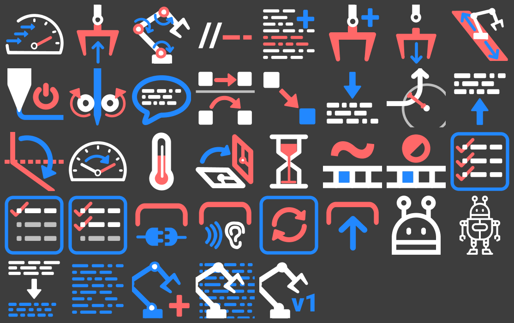
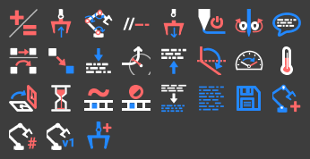
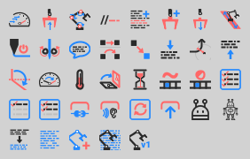

# Machina Icons

Main repo of Machina icons for graphics-oriented APIs. It includes the source SVG files and a custom icon processor to adapt them to graphical standards in different platforms, such as Dynamo, Grasshopper3d, etc.

Icon design credits go to the all-mighty [Juliana Tennett](https://github.com/JulianaTennett) :) Icons are not to be used or reproduced in any form without express consent from the author ([Juliana](https://github.com/JulianaTennett)). Recent contributions by @HakimHasan ! :)

---
## CURRENT VERSION

### DYNAMO (LARGE)

### DYNAMO (SMALL)

### GRASSHOPPER

